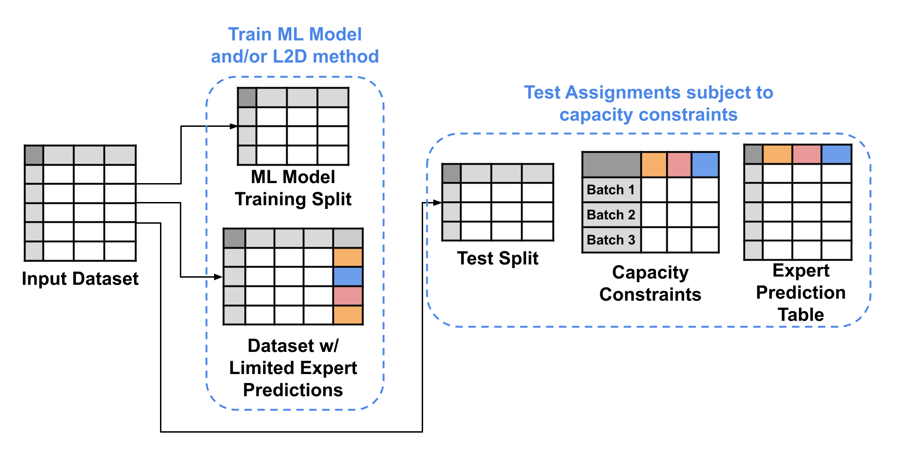

# **F**i**FAR** - A Fraud Detection Dataset for Learning to Defer

## Abstract

Public dataset limitations have significantly hindered the development and benchmarking of \textit{learning to defer} (L2D) algorithms, which aim to optimally combine human and AI capabilities in hybrid decision-making systems. In such systems, human availability and domain-specific concerns introduce difficulties, while obtaining human predictions for training and evaluation is costly. Financial fraud detection is a high-stakes setting where algorithms and human experts often work in tandem; however, there are no publicly available datasets for L2D concerning this important application of human-AI teaming. To fill this gap in L2D research, we introduce the \textit{Financial Fraud Alert Review} Dataset (FiFAR), a synthetic bank account fraud detection dataset, containing the predictions of a team of 50 highly complex and varied synthetic fraud analysts, with varied bias and feature dependence. We also provide a realistic definition of human work capacity constraints, an aspect of L2D systems that is often overlooked, allowing for extensive testing of assignment systems under real-world conditions.
We use our dataset to develop a capacity-aware L2D method and rejection learning approach under realistic data availability conditions, and benchmark these baselines under an array of 300 distinct testing scenarios. We believe that this dataset will serve as a pivotal instrument in facilitating a systematic, rigorous, reproducible, and transparent evaluation and comparison of L2D methods, thereby fostering the development of more synergistic human-AI collaboration in decision-making systems. The instantiated public dataset and detailed synthetic expert information are available [here](https://anonymous.4open.science/r/openl2ddataset-2590/).

## Overview

* [Resources](#Resources)
* [Installing Necessary Dependencies](#Installing-Necessary-Dependencies)
* [Using the FiFAR Dataset](#Using-the-OpenL2D-Fraud-Detection-Dataset)
* [Replicating our Experiments](#Replicating-our-experiments)

## Resources
In this repo, we provide users with:

* Code for use of our framework.
* [Datasets and models](https://drive.google.com/drive/folders/1nAUlxdOmwC6ZNtch3rxwKwNUVrYNmxkV) used in our benchmark.

The submitted version of the paper, the appendix, and the Datasheet are available in the following links:

* [Paper](Documents/Paper.pdf)
* [Appendix](Documents/Appendix.pdf)
* [Datasheet](Documents/Datasheet.pdf)

## Installing Necessary Dependencies

To use the provided code, please install the package available in the folder [Dependencies](Dependencies).

## Using the OpenL2D Fraud Detection Dataset

In our experiments, for training and testing of assignment methods, we utilized the **OpenL2D Fraud Detection Dataset**. This dataset is comprised of:

* An Input Dataset.
* Synthetic Expert prediction table.
* Dataset with limited expert predictions.
* Sets of capacity constraint tables.

For more information on each of these components, please consult the provided [Datasheet](Documents/Datasheet.pdf).

* ### Step 1: Download the Code in this repo:
The sets of capacity constraint tables and the synthetic expert prediction table are generated by using the input dataset and a set of configs included in this repo. For easy use of our dataset and available notebooks, we encourage users to download the repo in its entirety.

* ### Step 2: Download the Input Dataset
Our input dataset is the base variant of the Bank Account Fraud Tabular Dataset, available [here](https://www.kaggle.com/datasets/sgpjesus/bank-account-fraud-dataset-neurips-2022?resource=download&select=Base.csv). This dataset should then be placed in the folder [OpenL2D/data](OpenL2D/data).

* ### Step 3: Download the Models, Dataset with limited expert predictions and other necessary data.
The models used in our experiments and the dataset with limited expert predictions are available [here](https://drive.google.com/drive/folders/1nAUlxdOmwC6ZNtch3rxwKwNUVrYNmxkV). We also include the transformed input dataset in order to generate synthetic experts with our framework. 

* ### Step 4: Generating the expert prediction table and capacity constraint tables

To place all the necessary data in the correct directories, and generate the synthetic expert prediction table utilized in our experiments, as well as the capacity constraint tables used in our benchmarks, the user needs to run "[load\_data.py](load_data.py)". The script only requires the user to specify the directory of the datasets downloaded in Step 3. The expert prediction table is split according to the expert preprocessing and deployment splits. For more information consult Section 4.1 of the [paper](Documents/Paper.pdf)

### Uses of the L2D Fraud Detection Dataset

This dataset can be used to develop L2D methods under realistic conditions. Our dataset poses realistic challenges, such as:

* Limited expert prediction availability
* Developing algorithms under dynamic environments
* Human work capacity constraints

The Dataset with limited expert predictions can be used to train assignment systemds under realistic human data availability. Our expert prediction table contains 50 synthetic fraud analyst's predictions for each of the 1M instances of the BAF dataset. It can be used to train more data demanding algorithms, or to generate different training scenarios with the use of new capacity constraints. Our capacity constraint tables are also available, and are useful to test capacity aware assignment under a vast array of expert team configurations.

## Replicating our experiments

### L2D Baseline Results
After following the steps to obtain the **FiFAR Dataset**, detailed in the previous section, the user must run the file "[OpenL2D/testbed/run_tests.py](Code/testbed/run_tests.py)". This script produces the test split assignments for each testing scenario generated in Step 4 of the previous section. These assignments are obtained by using each of our 3 baseline models, detailed in the [paper](Documents/Paper.pdf), resulting in a total of 900 sets of assignments.

### ML Model and Human Expertise Model evaluation

The plots, numerical results, and hyperparameter choices relating to our ML model. are obtained using the script [OpenL2D/ml_model/training_and_predicting.py](OpenL2D/ml_model/training_and_predicting.py). 

The plots, numerical results, and hyperparameter choices relating to our Human Expertise model are obtained using the notebook [OpenL2D/expertise_models/model_analysis.ipynb](OpenL2D/expertise_models/model_analysis.ipynb). 

### Synthetic expert's decision evaluation

The plots and numerical results regarding our synthetic expert's generation process and decision properties are obtained using the notebook [OpenL2D/experts/expert_properties.ipynb](OpenL2D/experts/expert_properties.ipynb). 

