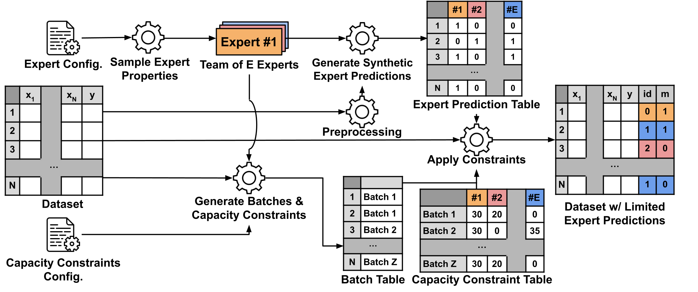

# OpenL2D: A Benchmarking Framework for Learning to Defer in Human-AI Decision-Making

## Abstract

Public dataset limitations have significantly hindered the development and benchmarking of _learning to defer_ (L2D) algorithms, which aim to optimally combine human and AI capabilities in hybrid decision-making systems. The development of these systems is primarily hindered by the high cost of obtaining human predictions for training and evaluation, leading researchers to often consider simplistic simulated human behaviour in their benchmarks. To overcome this challenge, we introduce OpenL2D, a novel framework designed to generate synthetic expert decisions and testbed settings for L2D methods. OpenL2D facilitates the creation of synthetic experts with adjustable bias and feature dependence, simulates realistic human work capacity constraints, and provides diverse training and testing conditions. We employ OpenL2D on a public fraud detection dataset to generate the _Financial Fraud Alert Review Dataset_ (FiFAR), containing predictions from a team of 50 fraud analysts for 30K alerted instances. We benchmark L2D baselines under a diverse array of conditions, subject to expert capacity constraints, demonstrating the unique, real-world challenges posed by FiFAR relative to previous benchmarks.

## Overview

* [Resources](#Resources)
* [Using FiFAR](#Using-FiFAR)
* [Replicating the Data Generation Process and L2D Benchmarking](#Replicating-the-Data-Generation-Process-and-L2D-Benchmarking)
* [Using the OpenL2D Framework](#Using-the-OpenL2D-Framework)

## Resources
In this repo, we provide users with:

* Instructions and code necessary to:
  * Use the OpenL2D synthetic data generation framework.
  * Generate the FiFAR dataset, available [here](https://drive.google.com/file/d/1ZHleGXqi3Oxu-gmvRnKEsiBXjjAMAdi4/view?usp=sharing).
  * Conduct our L2D benchmarks.
* Notebooks for evaluation of FiFAR experts' properties and L2D benchmarks.

The submitted version of the paper is available [here](Documents/Paper.pdf).

To ensure complete reproducibility, all the models, data (generated or otherwise), and results mentioned in our paper are included in the FiFAR dataset.

### Creating the Python Environment

Requirements:
* anaconda3
  
Before using any of the provided code, to ensure reproducibility, please create and activate the Python environment by running

```
conda env create -f openl2d-environment.yml
conda activate openl2d-env
```

## Using FiFAR

The FiFAR dataset is publicly available [here](https://drive.google.com/file/d/1ZHleGXqi3Oxu-gmvRnKEsiBXjjAMAdi4/view?usp=sharing). 
This dataset includes

* Version 1 of the Base Variant of the Bank Account Fraud Dataset.
* Alerts raised by the Alert Model, accompanied by said model's score.
* Synthetically generated predictions from a team of 50 fraud analysts.
* 25 distinct training scenarios, as well as 5 distinct testing scenarios for each trained algorithm.
* ML models used in the data generation process, technical validation, and L2D benchmarking.
  * Alert Model.
  * Feature Dependence Models.
  * DeCCaF and OvA Models - Classifier *h*, OvA Classifiers, and DeCCaF's team correctness prediction models.

This dataset is more thouroughly described in Section 4 of the [Data Descriptor](Documents/Paper.pdf).

We also facilitate further analysis of our generated experts and the conducted benchmarks, by providing users with two Jupyter Notebooks
* [Code/deferral/results.ipynb](Code/deferral/results.ipynb) - which contains
  * evaluation of the deferral performance of all considered L2D baselines
  * evaluation of the performance and calibration of Classifier *h*, OvA Classifiers, and DeCCaF's team correctness prediction models.
* [Code/synthetic_experts/expert_analysis.ipynb](Code/synthetic_experts/expert_analysis.ipynb) - which contains the evaluation of the expert decision-making process properties (intra and inter-rater agreement, feature dependence, fairness and performance) 

## Replicating the Data Generation Process and L2D Benchmarking

To replicate the generation of FiFAR, as well as our experiments, please execute the following steps:

**Attention**: Run each python script **inside** the folder where it is located, to ensure the relative paths within each script work correctly

### Step 1 - Clone the Repo and Download Dataset
After cloning the repo, please place FiFAR's folder inside the repo's folder, ensuring that your directory looks like this

```
openl2d
│   README.md
│   .gitignore  
│   openl2d-environment.yml
│
└─── Code
│   │   ...
│   
└─── FiFAR
    │   ...
│   
└─── OpenL2D Use Example
    │   ...
```

### Step 2 - Activate the Environment
To activate the Python environment with the necessary dependencies please follow [these steps](#Creating-the-Python-Environment)

### Step 3 - Train the Alert Model and create the set of alerts
To train the Alert Model, run the file [Code/alert_model/training_and_predicting.py](Code/alert_model/training_and_predicting.py), which will train the Alert Model and score all instances in months 4-8 of the BAF dataset.

Then, run the file [Code/alert_data/preprocess.py](Code/alert_data/preprocess.py), to create the dataset of 30K alerts raised in months 4-8. This will be the set of instances used over all following generation processes.

### Step 4 - Generate the Synthetic Expert predictions
To generate all the data within the folder "synthetic_experts" of FiFAR, run the script [Code/synthetic_experts/expert_gen.py](Code/synthetic_experts/expert_gen.py), which will generate the synthetic expert predictions, and also save their sampled parameters, calculated probabilities of error for each alerted instance, as well as the list of expert id's.

### Step 5 - Generate the Training and Testing Scenarios
To generate all 25 training scenarios, run the script [Code/testbed/testbed_train_alert_generation.py](Code/testbed/testbed_train_alert_generation.py).
To generate the 5 distinct capacity constraints to be applied to each of the deferral methods in testing, run the script [Code/testbed/testbed_test_generation.py](Code/testbed/testbed_test_generation.py).

### Step 6 - Train OvA and DeCCaF algorithms
As both of these algorithms share the classifier *h* (see Section *Training OvA and DeCCaF Baselines* of the [paper](Documents/Paper.pdf)), we first train this classifier, by running the script [Code/classifier_h/training.py](Code/classifier_h/training.py).

To train the OvA Classifiers run [Code/expert_models/run_ova.py](Code/expert_models/run_ova.py). To train the DeCCaF classifiers run [Code/expert_models/run_deccaf.py](Code/expert_models/run_deccaf.py)

### Step 7 - Run the Deferral Experiments

To reproduce the deferral testing run the script [Code/deferral/run_alert.py](Code/deferral/run_alert.py). These results can then be evaluated with the notebook [Code/deferral/results.ipynb](Code/deferral/results.ipynb)


## Using the OpenL2D Framework



### Defining the Input Dataset Properties
To use OpenL2D to generate experts on any tabular dataset, the file [Code/alert_data/dataset_cfg.yaml](Code/alert_data/dataset_cfg.yaml) must be adapted to your particular needs. 

This involves:
#### 1. Defining the dataset's columns.

* The user **must** define which column corresponds to the ground truth label
* The categorical features **must** also be defined if they exist.

Optionally the user may also define:
* The timestamp column: which can be used posteriorly to define training and testing splits, and can be taken into account in the generation of capacity constraints.
* The protected attribute column: which can be used to simulate experts with bias against a particular group based on said attribute.
* The model_score column: which can be used to simulate experts who have access to exterior information such as an ML Model's score.

FiFAR Example:
```yaml
data_cols:
  label: 'fraud_bool'        #Indicate the column corresponding to the label 
  timestamp: 'month'         #Optional: If the dataset has a temporal feature, define the timestamp column 
  protected: 'customer_age'  #Optional: If the dataset has a protected attribute, define said attribute's column
  model_score: 'model_score' #Optional: If the experts have access to a ML model's score, define its column
  categorical:               #Define the categorical feature's columns 
    - "payment_type"
    - "employment_status"
    - "housing_status"
    - "source"
    - "device_os"
```

#### 2. Defining the categorical dictionary.

For each categorical feature, the user must define the dictionary of possible categorical values, by setting
 * Key: categorical feature's column
 * Values: all possible values for said feature

This is done to ensure that the categorical features are encoded identically when passed to the LGBM models.

FiFAR Example:
```yaml
categorical_dict:
  device_os:
  - linux
  - macintosh
  - other
  - windows
  - x11
  employment_status:
  - CA
  - CB
  - CC
  - CD
  - CE
  - CF
  - CG
  housing_status:
  - BA
  - BB
  - BC
  - BD
  - BE
  - BF
  - BG
  payment_type:
  - AA
  - AB
  - AC
  - AD
  - AE
  source:
  - INTERNET
  - TELEAPP
```

#### 3. Defining the cost structure of the classification task
The user must also define the cost structure of the problem, by setting lambda = (cost of a false positive)/(cost of a false negative)
This value will be used in case the user wishes to sample expert performance as measured by the misclassification cost.

FiFAR example:
```yaml
lambda: 0.057
```

### Generating Synthetic Expert Decisions
To generate synthetic expert decisions, a user must place the following scripts in a folder:

* [Code/synthetic_experts/expert_gen.py](Code/synthetic_experts/expert_gen.py) - responsible for sampling the expert parameters and generating the expert objects
* [Code/synthetic_experts/expert_src.py](Code/synthetic_experts/expert_src.py) - contains the source code for the expert objects
* [Code/synthetic_experts/cfg.yaml](Code/synthetic_experts/cfg.yaml) - contains the user defined configurations to generate synthetic experts.

The user then only needs to define the necessary parameters in the "cfg.yaml" file, as such:
#### 1. Defining the input and output paths
Example:
```yaml
data_cfg_path: '../alert_data/dataset_cfg.yaml'                       #Path to the previously defined "dataset_cfg.yaml"
dataset_path: '../../FiFAR/alert_data/processed_data/alerts.parquet'  #Path to the data on which to generate synthetic expert decisions
destination_path: '../../FiFAR/synthetic_experts'                     #Output path for the generated expert decisions and sampled expert parameters             
```
#### 2. Defining the partition on which to fit the expert's performance
The user must define which partition of the dataset should be used to fit the values of beta_0 and beta_1
* **Option 1** - If the dataset has a timestamp column, fitting_set should be defined as the dates that delimit the partition
* **Option 2** - If the dataset does not have a timestamp column, fitting_set should be defined as the indexes that delimit the partition
The intervals are defined as [start,end) - the last value is not included

Example:
```yaml
fitting_set: [6,7] #We want to use the totality of month 6
```

#### 2. Defining the properties related to the protected attribute
*Note* - These can be ommited if there is no protected attribute

* **Option 1** - If your protected attribute is NUMERICAL, you must define:
  * protected_threshold - value that separates the two distinct groups
  * protected_values - whether the values 'higher' or 'lower' than the parameter are the protected group.
* **Option 2** -If your protected attribute is CATEGORICAL, you must define:
  * protected_class - value that corresponds to the protected group.

protected_threshold: 50
protected_values: 'higher'

#Define the baseline_group - This group must have all the necessary parameters defined. 
#In subsequent groups, should a parameter be missing, the experts will be generated using the same parameters defined for the baseline_group
baseline_group: 'standard'

There are two possible ways to define the feature weight sampling process (see Section *Synthetic Data Generation Framework - OpenL2D* of the Paper): by individually setting the distribution of each weight, or by defining the parameters of the spike and slab distribution, and manually defining the distribution of the model_score and protected attribute weights. 

The included [Code/synthetic_experts/cfg.yaml](Code/synthetic_experts/cfg.yaml) demonstrates how to manually define the weight distributions for each feature in the dataset. This is an example of how experts could be generated by using the spike and slab distribution

```yaml
experts:
  groups:
    standard:
      n: 50
      group_seed: 1
      w_stdev: 1
      w_mean: 0
      theta: 0.3
      score_stdev: 1
      score_mean: 0
      protected_stdev: 1
      protected_mean: 0
      alpha_mean: 15
      alpha_stdev: 3.5
      cost:
        target_mean: 0.035
        target_stdev: 0.005
        top_clip: 0.046
        bottom_clip: 0.02
        max_FPR: 1
        min_FPR: 0.01
        max_FNR: 1
        min_FNR: 0.01
```


For more details on each parameter and the decision generation process, consult Section *Synthetic Data Generation Framework - OpenL2D* of the [paper](Documents/Paper.pdf). Then, the user needs to run the script [Code/synthetic_experts/expert_gen.py](Code/synthetic_experts/expert_gen.py). This script produces the decision table as well as information regarding the expert decision generation properties (see Section 4 of the [paper](Documents/Paper.pdf)).


### Generating Training and Testing Scenarios
To generate one or more training scenarios, consisting of the set of training instances with one associated expert prediction per instance, the user needs to define the capacity constraints of each desired scenario, in the file [Code/testbed/cfg.yaml](Code/testbed/cfg.yaml). In this config file, the user must define the set of batch and capacity properties they desire, for the training and testing environments. An example follows:

```yaml
environments_train:
  batch:
    shuffle_1:
      size: 5000
      seed: 42
    shuffle_2:
      size: 5000
      seed: 43

  capacity:
    team_1:
      deferral_rate: 1
      n_experts: 10 #If n_experts is ommited, the entire team is used
      n_experts_seed: 42
      distribution: 'homogeneous' # If the distribution is homogeneous, we can ommit the other parameters
    team_2:
      deferral_rate: 1
      n_experts: 10
      n_experts_seed: 43
      distribution: 'variable'
      distribution_seed: 42
      distribution_stdev: 0.2

environments_test:
  batch:
    shuffle_1:
      size: 5000
      seed: 42
    shuffle_2:
      size: 5000
      seed: 43

  capacity:
    team_1:
      deferral_rate: 0.6
      n_experts: 10
      n_experts_seed: 42
      distribution: 'homogeneous'
    team_2:
      deferral_rate: 0.6
      n_experts: 10
      n_experts_seed: 43
      distribution: 'variable'
      distribution_seed: 42
      distribution_stdev: 0.2
```

Then, the user may run the script [Code/testbed/testbed_train_alert_generation.py](Code/testbed/testbed_train_alert_generation.py). For each desired dataset, this script creates a subfolder within FiFAR/testbed/train". Each dataset's subfolder contains that dataset's capacity constraints tables ("batches.csv" and "capacity.csv") and the dataset with limited expert predictions ("train.parquet").

To generate a set of capacity constraints to be applied in testing, the user needs to define the capacity constraints of each scenario, again in the file [Code/testbed/cfg.yaml](Code/testbed/cfg.yaml), and run the script [Code/testbed/testbed_test_generation.py](Code/testbed/testbed_test_generation.py). For each of the defined test scenarios, the script creates a subfolder within [OpenL2D/testbed/test](OpenL2D/testbed/test). This subfolder contains the capacity constraint tables ("batches.csv" and "capacity.csv") to be used in testing.


